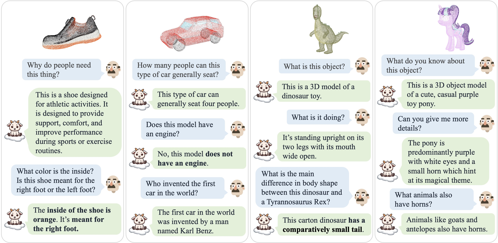
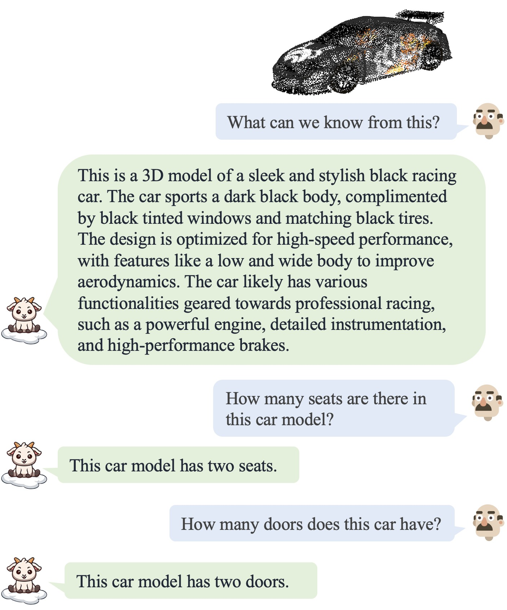
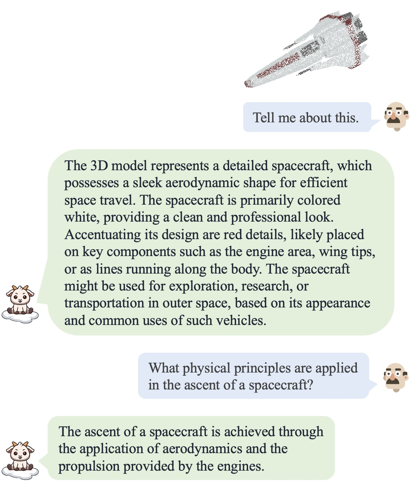
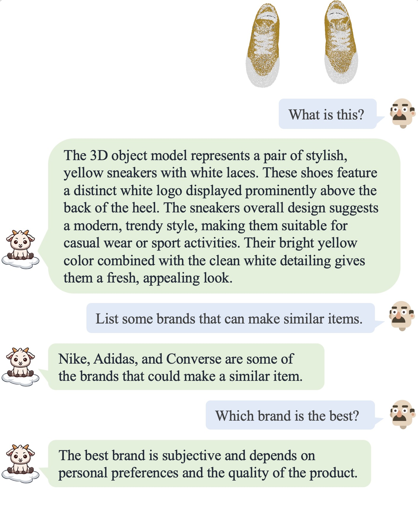
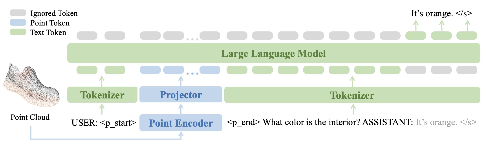
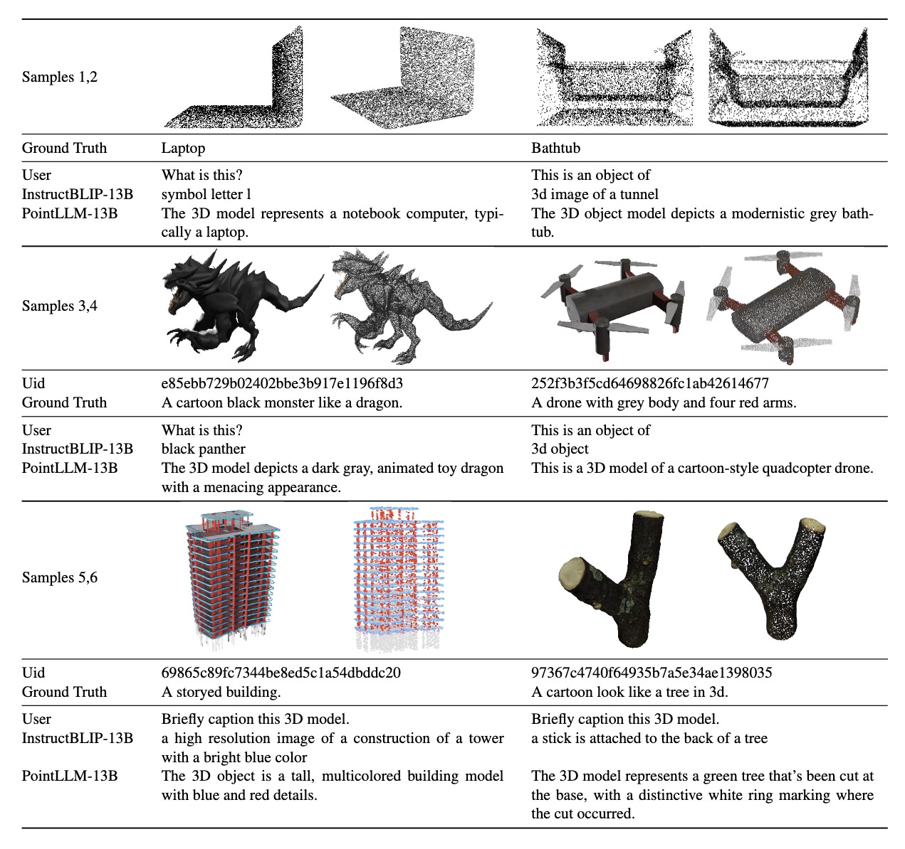

<br>
<p align="center">
<h1 align="center"><strong>PointLLM: Empowering Large Language Models to Understand Point Clouds</strong></h1>
  <p align="center">
    <a href='https://runsenxu.com/' target='_blank'>Runsen Xu</a>&emsp;
    <a href='https://guanfang12.github.io/' target='_blank'>Xiaolong Wang</a>&emsp;
    <a href='https://tai-wang.github.io/' target='_blank'>Tai Wang</a>&emsp;
    <a href='http://yilunchen.com/about' target='_blank'>Yilun Chen</a>&emsp;
    <a href='https://oceanpang.github.io/' target='_blank'>Jiangmiao Pang*</a>&emsp;
    <a href='http://dahua.site/' target='_blank'>Dahua Lin</a>&emsp;
    <br>
    The Chinese University of Hong Kong&emsp;Shanghai AI Laboratory&emsp;Zhejiang University
  </p>
</p>

<p align="center">
  <a href="http://arxiv.org/abs/2308.16911" target='_**blank**'>
    
  </a> 
  <a href="https://arxiv.org/pdf/2308.16911.pdf" target='_blank'>
    
  </a> 
  <a href="https://runsenxu.com/projects/PointLLM" target='_blank'>
    
  </a>
  <a href="http://101.230.144.196" target='_blank'>
    
  </a>
  <a href="" target='_blank'>
    
  </a>
  <a href="https://openxlab.org.cn/apps/detail/openxlab-app/PointLLM" target='_blank'>
    
  </a>
</p>

## 🏠 About
<!--  -->
<div style="text-align: center;">
    
</div>
We introduce <b>PointLLM, a multi-modal large language model capable of understanding colored point clouds of objects.</b> It perceives object types, geometric structures, and appearance without concerns for ambiguous depth, occlusion, or viewpoint dependency. <b>We collect a novel dataset comprising 660K simple and 70K complex point-text instruction pairs</b> to enable a two-stage training strategy. To rigorously evaluate our model's perceptual abilities and its generalization capabilities, <b>we establish two benchmarks: Generative 3D Object Classification and 3D Object Captioning, assessed through three different evaluation methods.</b>

## 🔥 News
- [2023-10-18] We release our instruction-following data, including both the simple-description and complex instructions. Download [here](https://huggingface.co/datasets/RunsenXu/PointLLM).
- [2023-09-26] We release the inferencing codes with checkpoints as well as the Objaverse colored point cloud files we use. You can chat with PointLLM with your own machines.
- [2023-08-31] We release the [paper](http://arxiv.org/abs/2308.16911) of PointLLM and an online gradio [demo](http://101.230.144.196). Try it! &#x1F389;

<!-- contents with emoji -->
## 📋 Contents
- [🤖 Online Demo](#-online-demo)
- [💬 Dialogue Examples](#-dialogue-examples)
- [🔍 Overview](#-overview)
- [📁 Instruction-Following Data](#-instruction-following-data)
- [📦 Inferencing](#-inferencing)
- [📝 TODO List](#-todo-list)
- [🔗 Citation](#-citation)
- [📄 License](#-license)
- [📚 Related Work](#-related-work)
- [👏 Acknowledgements](#-acknowledgements)

## 🤖 Online Demo
<b>PointLLM is online! Try it at [http://101.230.144.196](http://101.230.144.196) or at [OpenXLab/PointLLM](https://openxlab.org.cn/apps/detail/openxlab-app/PointLLM).</b>

You can chat with PointLLM about the models of the [Objaverse](https://objaverse.allenai.org) dataset or about your own point clouds!

Please do not hesitate to tell us if you have any feedback! 😃

## 💬 Dialogue Examples
| Dialogue 1 | Dialogue 2| Dialogue 3 | Dialogue 3
| :-: | :-: | :-: | :-: |
|  |   |   |  |


## 🔍 Overview

### Model
<p align="center">
  
</p>
The point encoder extracts features from the input point cloud and projects them to the latent space of the LLM backbone. The LLM backbone processes sequences of point tokens and text tokens, and generates the predicted tokens as the output.

### Experiment Results

#### Qualitative Comparisons with 2D Models
<p align="center">
  
</p>

## 📁 Instruction-Following Data
Our instruction-following data, including both the simple-description and complex instructions, can be downloaded [here](https://huggingface.co/datasets/RunsenXu/PointLLM). If you have difficulty downloading the data (e.g. network issue), please email the authors.
- The simple-description data has 660K samples and the complex instructions have 70K samples.
- Both training data are based on the Objaverse dataset.
- The complex instructions are generated with GPT-4.

## 📦 Inferencing
### Installation
We test our codes under the following environment:
- Ubuntu 20.04
- NVIDIA Driver: 515.65.01
- CUDA 11.7
- Python 3.10.13
- PyTorch 2.0.1
- Transformers 4.28.0.dev(transformers.git@cae78c46)

To start: 
1. Clone this repository.
```bash
git clone git@github.com:OpenRobotLab/PointLLM.git
cd PointLLM
```
2. Install packages
```bash
conda create -n pointllm python=3.10 -y
conda activate pointllm
pip install --upgrade pip  # enable PEP 660 support
pip install -e .
```

### Data Preparation
1. Download the two compressed files of 660K Objaverse colored point clouds [here](https://huggingface.co/datasets/RunsenXu/PointLLM/tree/main). They require about 77GB of storage space.
2. Run the following command to merge the two files into one and uncompress it. This will produce a folder named `8192_npy` containing 660K point cloud files named `{Objaverse_ID}_8192.npy`. Each file is a numpy array with dimensions (8192, 6).
```bash
cat Objaverse_660K_8192_npy_split_a* > Objaverse_660K_8192_npy.tar.gz
tar -xvf Objaverse_660K_8192_npy.tar.gz
```
3. In `PointLLM` folder, create a soft link to the uncompressed file in the directory.
```bash
cd PointLLM
ln -s /path/to/8192_npy objaverse_data
```

### Chatting
1. The model checkpoints are available at [PointLLM_7B_v1.1](https://huggingface.co/RunsenXu/PointLLM_7B_v1.1/tree/main) and [PointLLM_13B_v1.1](https://huggingface.co/RunsenXu/PointLLM_13B_v1.1/tree/main).
2. Run the following command to launch a chatbot using the `torch.float32` data type for chatting about 3D models of Objaverse. The model checkpoints will be downloaded automatically. You can also manually download the model checkpoints and specify their paths.
```bash
cd PointLLM
python pointllm/eval/PointLLM_chat.py --model-path RunsenXu/PointLLM_7B_v1.1 --data-path objaverse_data --torch-dtype float32
```
3. You can also easily modify the codes for using point clouds other than those from Objaverse, as long as the point clouds input to the model have dimensions (N, 6), where the first three dimensions are `xyz` and the last three dimensions are `rgb`. You may sample the point clouds to have 8192 points, as our model is trained on such point clouds.
4. The following table shows GPU requirements for different models and data types. We recommend using `torch.bfloat16` if applicable, which is used in the experiments in our paper.

|  Model   | Data Type | GPU Memory |
|:--------:|:---------:|:----------:|
| PointLLM-7B  | torch.float16 |    14GB    |
| PointLLM-7B  | torch.float32 |    28GB    |
| PointLLM-13B | torch.float16 |    26GB    |
| PointLLM-13B | torch.float32 |    52GB    |


## 📝 TODO List
- [x] Add inferencing codes with checkpoints.
- [x] Release instruction-following data.
- [ ] Add training codes.
- [ ] Add evaluation codes.
- [ ] Add data generation codes.

## 🔗 Citation

If you find our work helpful, please cite:

```bibtex
@article{xu2023pointllm,
  title={PointLLM: Empowering Large Language Models to Understand Point Clouds},
  author={Xu, Runsen and Wang, Xiaolong and Wang, Tai and Chen, Yilun and Pang, Jiangmiao and Lin, Dahua},
  journal={arXiv preprint arXiv:2308.16911},
  year={2023}
}
```

## 📄 License
<a rel="license" href="http://creativecommons.org/licenses/by-nc-sa/4.0/"></a>
<br />
This work is under the <a rel="license" href="http://creativecommons.org/licenses/by-nc-sa/4.0/">Creative Commons Attribution-NonCommercial-ShareAlike 4.0 International License</a>.

## 📚 Related Work
Together, Let's make LLM for 3D great!
- [Point-Bind & Point-LLM](https://arxiv.org/abs/2309.00615): aligns point clouds with Image-Bind, and leverages ImageBind-LLM to reason multi-modality input without 3D-instruction data training.
- [3D-LLM](https://arxiv.org/abs/2307.12981): employs 2D foundation models to encode multi-view images of 3D point clouds.


## 👏 Acknowledgements
- [LLaVA](https://github.com/haotian-liu/LLaVA): Our codebase is built upon LLaVA.
- [Vicuna](https://github.com/lm-sys/FastChat): We use the Vicuna-7B and Vicuna-13B checkpoints.
- [Objaverse](https://objaverse.allenai.org): We use models of the Objaverse dataset for training and evaluation.
- [Cap3D](https://github.com/crockwell/Cap3D/): We use the Cap3D captioning data for our data generation.
- [ULIP-2](https://github.com/salesforce/ULIP): We use ULIP-2 for pre-training our point cloud encoder.
