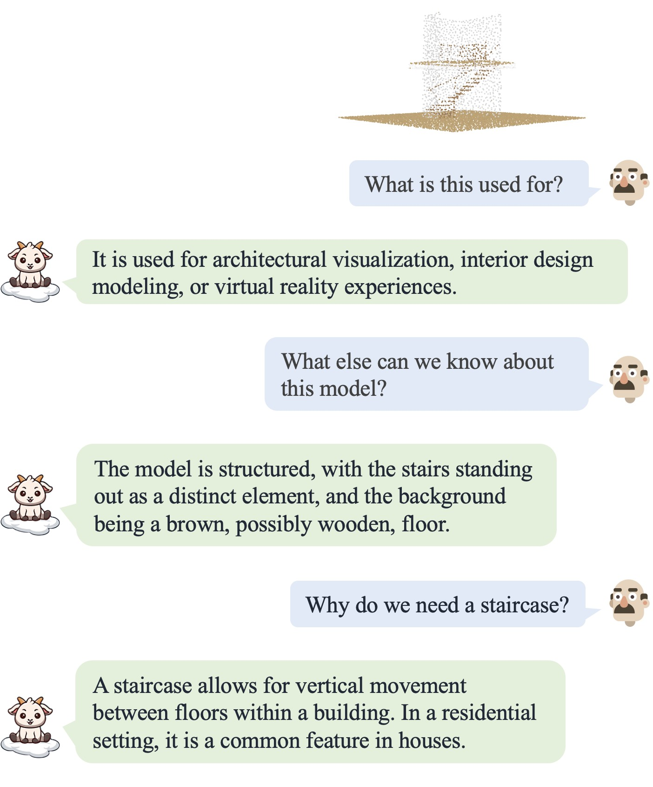
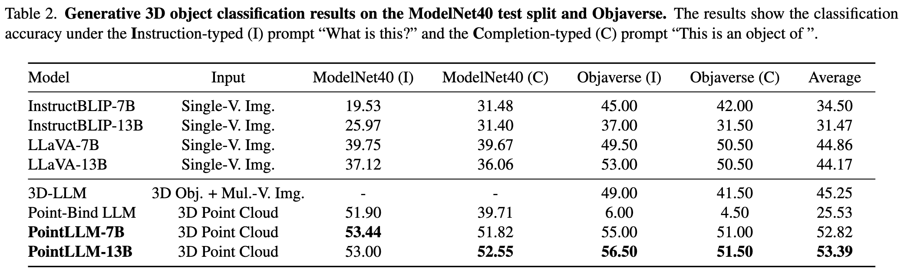
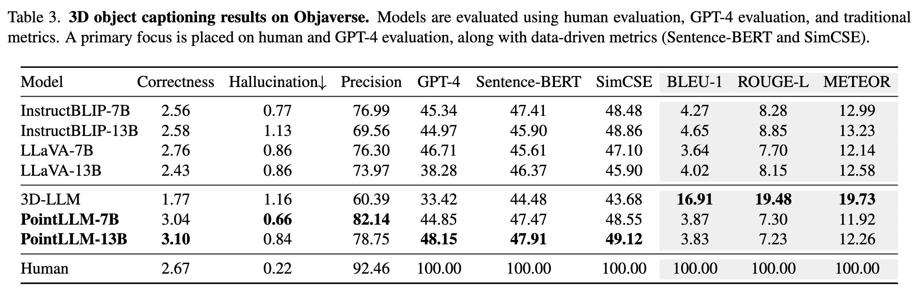

<br>
<p align="center">
<h1 align="center"><strong>PointLLM: Empowering Large Language Models to Understand Point Clouds</strong></h1>
  <p align="center">
    <a href='https://runsenxu.com/' target='_blank'>Runsen Xu</a>&emsp;
    <a href='https://guanfang12.github.io/' target='_blank'>Xiaolong Wang</a>&emsp;
    <a href='https://tai-wang.github.io/' target='_blank'>Tai Wang</a>&emsp;
    <a href='http://yilunchen.com/about' target='_blank'>Yilun Chen</a>&emsp;
    <a href='https://oceanpang.github.io/' target='_blank'>Jiangmiao Pang*</a>&emsp;
    <a href='http://dahua.site/' target='_blank'>Dahua Lin</a>&emsp;
    <br>
    The Chinese University of Hong Kong&emsp;Shanghai AI Laboratory&emsp;Zhejiang University
  </p>
</p>

<p align="center">
  <a href="http://arxiv.org/abs/2308.16911" target='_**blank**'>
    
  </a> 
  <a href="https://arxiv.org/pdf/2308.16911.pdf" target='_blank'>
    
  </a> 
  <a href="https://runsenxu.com/projects/PointLLM" target='_blank'>
    
  </a>
  <a href="" target='_blank'>
    
  </a>
  <a href="" target='_blank'>
    
  </a>
  <a href="https://openxlab.org.cn/apps/detail/openxlab-app/PointLLM" target='_blank'>
    
  </a>
</p>

## 🏠 About
<!--  -->
<div style="text-align: center;">
    
</div>
We introduce <b>PointLLM, a multi-modal large language model capable of understanding colored point clouds of objects.</b> It perceives object types, geometric structures, and appearance without concerns for ambiguous depth, occlusion, or viewpoint dependency. <b>We collect a novel dataset comprising 660K simple and 70K complex point-text instruction pairs</b> to enable a two-stage training strategy. To rigorously evaluate our model's perceptual abilities and its generalization capabilities, <b>we establish two benchmarks: Generative 3D Object Classification and 3D Object Captioning, assessed through three different evaluation methods.</b>

## 🔥 News
- [2025-04-21] We closed our online demo because we need to use the serving machine for other purposes.
- [2024-09-06] We have uploaded the camera-ready version of PointLLM for ECCV 2024, which includes clearer writing and additional experimental results. Please check the paper [here](https://arxiv.org/abs/2308.16911).
- [2024-07-01] PointLLM has been accepted by ECCV 2024 with all "strong-accept" recommendation. 🎉 We are looking for self-motivated students to conduct research regarding PointLLM. Please send an email to runsxu@gmail.com with your CV if you are interested!
- [2023-12-29] We release the codes of our online Gradio demo.
- [2023-12-26] We release the codes for model evaluation, including ChatGPT/GPT-4 evaluation and traditional metric evaluation.
- [2023-12-08] We release the codes for training and PointLLM-v1.2. The online demo has also been upgraded to the v1.2 version. Please enjoy! &#x1F389; 
- [2023-12-01] We have released an updated version of our paper (v2), which includes additional baseline comparisons, enhanced human-evaluation metrics, improved model performance (PointLLM-v1.2), and other refinements. Please check the updated version [here](https://arxiv.org/abs/2308.16911).
- [2023-10-18] We release our instruction-following data, including both the simple-description and complex instructions. Download [here](https://huggingface.co/datasets/RunsenXu/PointLLM).
- [2023-09-26] We release the inferencing codes with checkpoints as well as the Objaverse colored point cloud files we use. You can chat with PointLLM with your own machines.
- [2023-08-31] We release the [paper](http://arxiv.org/abs/2308.16911) of PointLLM and an online gradio demo. Try it! &#x1F389;

<!-- contents with emoji -->
## 📋 Contents
- [🤖 Online Demo](#-online-demo)
- [💬 Dialogue Examples](#-dialogue-examples)
- [🔍 Overview](#-overview)
- [📦 Training and Evaluation](#-training-and-evaluation)
- [📝 TODO List](#-todo-list)
- [🔗 Citation](#-citation)
- [📄 License](#-license)
- [📚 Related Work](#-related-work)
- [👏 Acknowledgements](#-acknowledgements)


## 💬 Dialogue Examples
| Dialogue 1 | Dialogue 2| Dialogue 3 | Dialogue 4
| :-: | :-: | :-: | :-: |
|  |   |   |  |


## 🔍 Overview

### Model
<p align="center">
  
</p>
The point encoder extracts features from the input point cloud and projects them to the latent space of the LLM backbone. The LLM backbone processes sequences of point tokens and text tokens, and generates the predicted tokens as the output.

### Experiment Results
#### Quantitative Comparisons with baselines.
Please refer to our paper for more results.
<p align="center">
  
</p>
<p align="center">
  
</p>
<b>!!!Note: Traditional metrics such as BLEU-1, ROUGE-L, and METEOR tend to favor shorter responses and may not effectively capture semantic accuracy. For a detailed discussion on this, please refer to our paper. We suggest the community not solely rely on these metrics for evaluation.</b>

#### Qualitative Comparisons with baselines.
Please refer to our paper for more results.
<p align="center">
  
</p>

## 📦 Training and Evaluation
### Installation
We test our codes under the following environment:
- Ubuntu 20.04
- NVIDIA Driver: 515.65.01
- CUDA 11.7
- Python 3.10.13
- PyTorch 2.0.1
- Transformers 4.28.0.dev(transformers.git@cae78c46)

To start: 
1. Clone this repository.
```bash
git clone git@github.com:OpenRobotLab/PointLLM.git
cd PointLLM
```
2. Install packages
```bash
conda create -n pointllm python=3.10 -y
conda activate pointllm
pip install --upgrade pip  # enable PEP 660 support
pip install -e .

# * for training
pip install ninja
pip install flash-attn
```

### Data Preparation
#### Objaverse Training Data
1. Download the two compressed files of 660K Objaverse colored point clouds [here](https://huggingface.co/datasets/RunsenXu/PointLLM/tree/main). They require about 77GB of storage space.
2. Run the following command to merge the two files into one and uncompress it. This will produce a folder named `8192_npy` containing 660K point cloud files named `{Objaverse_ID}_8192.npy`. Each file is a numpy array with dimensions (8192, 6), where the first three dimensions are `xyz` and the last three dimensions are `rgb` in [0, 1] range.
```bash
cat Objaverse_660K_8192_npy_split_a* > Objaverse_660K_8192_npy.tar.gz
tar -xvf Objaverse_660K_8192_npy.tar.gz
```
3. In `PointLLM` folder, create a folder `data` and create a soft link to the uncompressed file in the directory.
```bash
cd PointLLM
mkdir data
ln -s /path/to/8192_npy data/objaverse_data
```

#### Instruction-Following Data
1. In `PointLLM/data` folder, create a directory named `anno_data`.
2. Our instruction-following data, including both the simple-description and complex instructions, can be downloaded [here](https://huggingface.co/datasets/RunsenXu/PointLLM). If you have difficulty downloading the data (e.g. network issue), please email the authors.
- The simple-description data has 660K samples and the complex instructions have 70K samples.
- Both training data are based on the Objaverse dataset.
- The complex instructions are generated with GPT-4.
3. Put the data files in the `anno_data` directory. The directory should look like this:
```bash
PointLLM/data/anno_data
├── PointLLM_brief_description_660K_filtered.json
├── PointLLM_brief_description_660K.json
└── PointLLM_complex_instruction_70K.json
```
4. Note, the `PointLLM_brief_description_660K_filtered.json` is filtered from `PointLLM_brief_description_660K.json` by removing the 3000 objects we reserved as the validation set. If you want to reproduce the results in our paper, you should use the `PointLLM_brief_description_660K_filtered.json` for training. The `PointLLM_complex_instruction_70K.json` contains objects from the training set.
5. If you want to generate the complex instructions by yourself, please refer to our paper for other details. The system prompt is at `pointllm/data/data_generation/system_prompt_gpt4_0613.txt`.

#### Evaluation Data
1. Download the referencing GT `PointLLM_brief_description_val_200_GT.json` we use for the benchmarks on Objaverse dataset [here](https://huggingface.co/datasets/RunsenXu/PointLLM/blob/main/PointLLM_brief_description_val_200_GT.json), and put it in `PointLLM/data/anno_data`. We also provide the 3000 object ids we filter during training [here](https://huggingface.co/datasets/RunsenXu/PointLLM/blob/main/val_object_ids_3000.txt) and their corresponding referencing GT [here](https://huggingface.co/datasets/RunsenXu/PointLLM/blob/main/PointLLM_brief_description_val_3000_GT.json), which can be used to evaluate on all the 3000 objects.
2. Create a directory named `modelnet40_data` in `PointLLM/data`. Download the test split of ModelNet40 point clouds `modelnet40_test_8192pts_fps.dat` [here](https://huggingface.co/datasets/RunsenXu/PointLLM/blob/main/modelnet40_test_8192pts_fps.dat) and put it in `PointLLM/data/modelnet40_data`.

### Training
#### Download the Initial LLM and Point Encoder Weights
1. In `PointLLM` folder, create a directory named `checkpoints`.
2. Download the pre-trained LLM and point encoder: [
PointLLM_7B_v1.1_init](https://huggingface.co/RunsenXu/PointLLM_7B_v1.1_init/tree/main) or [PointLLM_13B_v1.1_init](https://huggingface.co/RunsenXu/PointLLM_13B_v1.1_init/tree/main). Put them in the `checkpoints` directory.
3. Note that the above "v1.1" means we use the Vicuna-v1.1 checkpoints, and you do **not** need to download the original LLaMA weights again. 

#### Start Training
1. For stage-1 training, simply run:
```bash
cd PointLLM
scripts/PointLLM_train_stage1.sh
```
2. After stage-1 training, start stage-2 training:
```bash
scripts/PointLLM_train_stage2.sh
```

#### PointLLM-v1.1 and PointLLM-v1.2
Usually, you do not have to care about the following contents. They are only for reproducing the results in our v1 paper (PointLLM-v1.1). If you want to compare with our models or use our models for downstream tasks, please use PointLLM-v1.2 (refer to our v2 paper), which has better performance.
<details>
  <summary>The following steps are for reproducing PointLLM-v1.1 (click to expand)</summary>
  
1. PointLLM v1.1 and v1.2 use slightly different pre-trained point encoders and projectors. If you want to reproduce PointLLM v1.1, edit the `config.json` file in the directory of initial LLM and point encoder weights, for example, `vim checkpoints/PointLLM_7B_v1.1_init/config.json`.
  
2. Change the key `"point_backbone_config_name"` to specify another point encoder config:
    ```bash
    # change from
    "point_backbone_config_name": "PointTransformer_8192point_2layer" # v1.2
    # to
    "point_backbone_config_name": "PointTransformer_base_8192point", # v1.1
    ```

3. Edit the checkpoint path of the point encoder in `scripts/train_stage1.sh`:
    ```bash
    # change from
    point_backbone_ckpt=$model_name_or_path/point_bert_v1.2.pt # v1.2
    # to
    point_backbone_ckpt=$model_name_or_path/point_bert_v1.1.pt # v1.1
    ```
</details>

### Chatting
1. The trained model checkpoints are available [here](https://huggingface.co/RunsenXu) (including different versions of PointLLM). 
2. Run the following command to launch a chatbot using the `torch.float32` data type for chatting about 3D models of Objaverse. The model checkpoints will be downloaded automatically. You can also manually download the model checkpoints and specify their paths. Here is an example:
```bash
cd PointLLM
PYTHONPATH=$PWD python pointllm/eval/PointLLM_chat.py --model_name RunsenXu/PointLLM_7B_v1.2 --data_name data/objaverse_data --torch_dtype float32
```
3. You can also easily modify the codes for using point clouds other than those from Objaverse, as long as the point clouds input to the model have dimensions (N, 6), where the first three dimensions are `xyz` and the last three dimensions are `rgb` (in [0, 1] range). You may sample the point clouds to have 8192 points, as our model is trained on such point clouds.
4. The following table shows GPU requirements for different models and data types. We recommend using `torch.bfloat16` if applicable, which is used in the experiments in our paper.
   
    |  Model   | Data Type | GPU Memory |
    |:--------:|:---------:|:----------:|
    | PointLLM-7B  | torch.float16 |    14GB    |
    | PointLLM-7B  | torch.float32 |    28GB    |
    | PointLLM-13B | torch.float16 |    26GB    |
    | PointLLM-13B | torch.float32 |    52GB    |

### Gradio Demo
1. We provide the codes for our online Gradio demo. You can run the following commands to launch the demo locally for chatting and visualization.
```bash
cd PointLLM
PYTHONPATH=$PWD python pointllm/eval/chat_gradio.py --model_name RunsenXu/PointLLM_7B_v1.2 --data_name data/objaverse_data
```
2. Kind remind: if you want to release the demo in public, please refer to https://www.gradio.app/guides/sharing-your-app#security-and-file-access.

### Evaluation
#### Inferencing
1. Run the following commands to infer the results.
2. Different commands for inferencing on different benchmarks (PointLLM_7B_v1.2 as an example):
```bash
cd PointLLM
export PYTHONPATH=$PWD

# Open Vocabulary Classification on Objaverse
python pointllm/eval/eval_objaverse.py --model_name RunsenXu/PointLLM_7B_v1.2 --task_type classification --prompt_index 0 # or --prompt_index 1

# Object captioning on Objaverse
python pointllm/eval/eval_objaverse.py --model_name RunsenXu/PointLLM_7B_v1.2 --task_type captioning --prompt_index 2

# Close-set Zero-shot Classification on ModelNet40
python pointllm/eval/eval_modelnet_cls.py --model_name RunsenXu/PointLLM_7B_v1.2 --prompt_index 0 # or --prompt_index 1
```
3. Please check the default command-line arguments of these two scripts. You can specify different prompts, data paths, and other parameters. 
4. After inferencing, the results will be saved in `{model_name}/evaluation` as a dict with the following format:
```bash
{
  "prompt": "",
  "results": [
    {
      "object_id": "",
      "ground_truth": "", 
      "model_output": "",
      "label_name": "" # only for classification on modelnet40
    }
  ]
}
```

#### ChatGPT/GPT-4 Evaluation
1. Get your OpenAI API key at [https://platform.openai.com/api-keys](https://platform.openai.com/api-keys).
2. Run the following commands to evaluate the model outputs in parallel with ChatGPT/GPT-4 (which cost approximately $1.5 to $2.2 USD).
```bash
cd PointLLM
export PYTHONPATH=$PWD
export OPENAI_API_KEY=sk-****

# Open Vocabulary Classification on Objaverse
python pointllm/eval/evaluator.py --results_path /path/to/model_output --model_type gpt-4-0613 --eval_type open-free-form-classification --parallel --num_workers 15

# Object captioning on Objaverse
python pointllm/eval/evaluator.py --results_path /path/to/model_output --model_type gpt-4-0613 --eval_type object-captioning --parallel --num_workers 15

# Close-set Zero-shot Classification on ModelNet40
python pointllm/eval/evaluator.py --results_path /path/to/model_output --model_type gpt-3.5-turbo-0613 --eval_type modelnet-close-set-classification --parallel --num_workers 15
```
3. The evaluation script supports interruption and resumption. You can interrupt the evaluation process at any time by using `Ctrl+C`. This will save the temporary results. If an error occurs during the evaluation, the script will also save the current state. You can resume the evaluation from where it left off by running the same command again.
4. The evaluation results will be saved in `{model_name}/evaluation` as another dict.
Some of the metrics are explained as follows:
```bash
"average_score": The GPT-evaluated captioning score we report in our paper.
"accuracy": The classification accuracy we report in our paper, including random choices made by ChatGPT when model outputs are vague or ambiguous and ChatGPT outputs "INVALID".
"clean_accuracy": The classification accuracy after removing those "INVALID" outputs.
"total_predictions": The number of predictions.
"correct_predictions": The number of correct predictions.
"invalid_responses": The number of "INVALID" outputs by ChatGPT.

# Some other statistics for calling OpenAI API
"prompt_tokens": The total number of tokens of the prompts for ChatGPT/GPT-4.
"completion_tokens": The total number of tokens of the completion results from ChatGPT/GPT-4.
"GPT_cost": The API cost of the whole evaluation process, in US Dollars 💵.
```
5. <b>Open-Step Evaluation.</b> You can also start evaluation immediately after inferencing by passing the `--start_eval` flag and specifying the `--gpt_type`. For example:
```bash
python pointllm/eval/eval_objaverse.py --model_name RunsenXu/PointLLM_7B_v1.2 --task_type classification --prompt_index 0 --start_eval --gpt_type gpt-4-0613
```

#### Traditional Metric Evaluation
1. For the object captioning task, run the following command to evaluate model outputs with traditional metrics including BLEU, ROUGE, METEOR, Sentence-BERT, and SimCSE.
```bash
python pointllm/eval/traditional_evaluator.py --results_path /path/to/model_captioning_output
```
2. Note that we recommend not using BLEU, ROUGE, and METEOR for evaluation as they favor short captions and fall short of capturing semantic accuracy and diversity.

## 📝 TODO List
- [x] Add inferencing codes with checkpoints.
- [x] Release instruction-following data.
- [x] Add training codes.
- [x] Add evaluation codes.
- [x] Add gradio demo codes.
- [ ] Release PointLLM-V2 with a better model and data.

Community contributions are welcome!👇 If you need any support, please feel free to open an issue or contact us.
- [ ] Support Phi-2 LLM to make PointLLM more accessible to the community.
- [ ] Support Chinese LLMs like InternLM.

## 🔗 Citation

If you find our work and this codebase helpful, please consider starring this repo 🌟 and cite:

```bibtex
@inproceedings{xu2024pointllm,
  title={PointLLM: Empowering Large Language Models to Understand Point Clouds},
  author={Xu, Runsen and Wang, Xiaolong and Wang, Tai and Chen, Yilun and Pang, Jiangmiao and Lin, Dahua},
  booktitle={ECCV},
  year={2024}
}
```

## 📄 License
<a rel="license" href="http://creativecommons.org/licenses/by-nc-sa/4.0/"></a>
<br />
This work is under the <a rel="license" href="http://creativecommons.org/licenses/by-nc-sa/4.0/">Creative Commons Attribution-NonCommercial-ShareAlike 4.0 International License</a>.

## 📚 Related Work
Together, Let's make LLM for 3D great!
- [Point-Bind & Point-LLM](https://arxiv.org/abs/2309.00615): aligns point clouds with Image-Bind, and leverages ImageBind-LLM to reason multi-modality input without 3D-instruction data training.
- [3D-LLM](https://arxiv.org/abs/2307.12981): employs 2D foundation models to encode multi-view images of 3D point clouds.


## 👏 Acknowledgements
- [LLaVA](https://github.com/haotian-liu/LLaVA): Our codebase is built upon LLaVA.
- [Vicuna](https://github.com/lm-sys/FastChat): We use the Vicuna-7B and Vicuna-13B checkpoints.
- [Objaverse](https://objaverse.allenai.org): We use models of the Objaverse dataset for training and evaluation.
- [Cap3D](https://github.com/crockwell/Cap3D/): We use the Cap3D captioning data for our data generation.
- [ULIP-2](https://github.com/salesforce/ULIP): We use ULIP-2 for pre-training our point cloud encoder.
